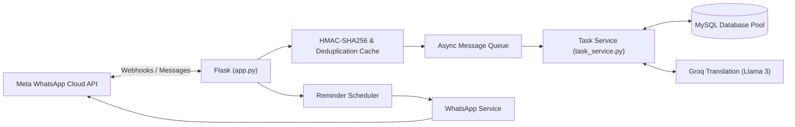

# 💬 WhatsApp Team Management Bot

[](https://www.python.org/)
[](https://flask.palletsprojects.com/)
[](https://developers.facebook.com/docs/whatsapp/cloud-api)
[](https://www.mysql.com/)
[](https://groq.com/)
[](Jenkinsfile)

**WhatsApp Team Management Bot** is a production-grade WhatsApp bot built with Flask and the **Meta WhatsApp Cloud API**. It allows managers and team members to create tasks, assign work, update task progress, track deadlines, send automated scheduled reminders, and communicate across multiple languages (Hindi/English) directly within WhatsApp.

---

## 🚀 Key Features

- 📋 **Complete Task Lifecycle**: Create tasks, assign them to team members by phone number, update statuses (`Pending`, `In-Progress`, `Completed`), and view pending backlogs.
- 🌐 **Multilingual Translation (Groq & Fallback)**: Powered by Groq (Llama 3) with fallback translation to seamlessly support English, Hindi, and Hinglish.
- ⏰ **Automated Reminder Scheduler**: Background cron scheduler running automated deadline alerts, daily digest reminders, and overdue follow-ups.
- 🛡️ **Enterprise Security & Reliability**:
  - `HMAC-SHA256` signature verification on all Meta webhook payloads.
  - Thread-safe LRU message deduplication cache with TTL to prevent re-processing.
  - Request rate limiting using Flask-Limiter.
  - Asynchronous background worker queue for non-blocking webhook acknowledgments.
- 📊 **Database Connection Pool & Analytics**: MySQL connection pooling (`db_pool.py`), session management (`bot_session.py`), and interaction telemetry logging.

---

## 🏗️ Architecture



---

## 📂 Project Structure

```
team_management_bot/
├── app.py                             # Main Flask webhook application & async dispatcher
├── requirements.txt                   # Dependencies (Flask, mysql-connector, groq, schedule)
├── Jenkinsfile                        # Automated Jenkins CI/CD deployment pipeline
├── models/
│   ├── db_pool.py                     # Threaded MySQL connection pool
│   ├── bot_session.py                 # User conversation state manager
│   ├── task.py                        # Task data model & queries
│   ├── team.py                        # Team organizational model
│   ├── team_member.py                 # Member profile & phone mapping
│   └── analytics.py                   # Event tracking & metrics
├── services/
│   ├── task_service.py                # Core business logic for task management
│   ├── whatsapp_service.py            # Meta WhatsApp Cloud API wrapper
│   ├── reminder_service.py            # Background reminder cron jobs
│   ├── groq_translation_service.py    # AI translation using Groq Llama 3
│   ├── free_translation_service.py    # Fallback translation provider
│   ├── language_service.py            # User language preference detection
│   └── image_service.py               # Media handler for attachments
└── utils/
    └── helpers.py                     # Phone normalization & formatting utilities
```

---

## ⚙️ Installation & Setup

### Prerequisites
- Python 3.11+
- MySQL 8.0+
- Meta Developer Account with WhatsApp Cloud API access
- Groq API Key (for high-speed translation)

### 1. Setup Environment
```bash
git clone https://github.com/techgroupranchi02/team_management_bot.git
cd team_management_bot

python -m venv venv
source venv/bin/activate  # Or .\venv\Scripts\activate on Windows

pip install -r requirements.txt
```

### 2. Configure Environment Variables
Create a `.env` file:
```env
# Meta WhatsApp API Credentials
WHATSAPP_TOKEN=your_meta_system_user_token
WHATSAPP_PHONE_NUMBER_ID=your_phone_number_id
META_APP_SECRET=your_meta_app_secret
WEBHOOK_VERIFY_TOKEN=your_custom_verify_token

# Database Configuration
DB_HOST=localhost
DB_PORT=3306
DB_USER=your_db_user
DB_PASSWORD=your_db_password
DB_NAME=team_bot_db

# AI & Translation
GROQ_API_KEY=your_groq_api_key

# Security & Admin
ADMIN_API_KEY=your_admin_secret_key
FLASK_ENV=production
```

### 3. Run the Bot
```bash
# Development
python app.py

# Production with Gunicorn
gunicorn -w 1 -b 0.0.0.0:5000 app:app
```

---

## 🚀 CI/CD Pipeline
The repository includes a production [Jenkinsfile](Jenkinsfile) providing automated linting, testing, and zero-downtime deployment to remote VPS servers upon push to `master`.

---

## 📜 License
This project is licensed under the MIT License.
